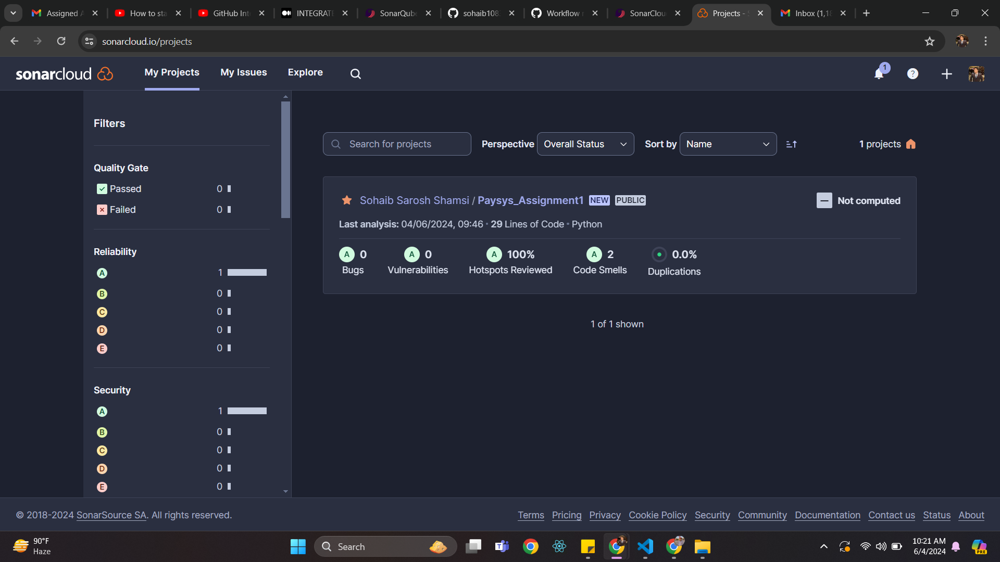

 

<h1 align="center">Paysys Assignment</h1>

  

     
    <a href="https://github.com/sohaib1083/Paysys_Assignment1"><strong>Explore the docs »</strong></a>
     
  

## Python code
 
  I have use python as my programming language to create all the program requirements as shown above.
  
## Unit Testing
 
 
  I have used built-in python unittest framework to cater all possible edge cases.

## CI/CD Pipeline
### Pipeline Overview
This section describes the steps taken to set up and run the CI/CD pipeline using GitHub Actions.

### Step 1: Workflow File (ci.yml)

The workflow file is located in the `.github/workflows/` directory. It defines the CI/CD pipeline steps to automatically run the unit tests whenever changes are pushed to the repository.
 
 
steps (labelled on workflow file): 
- Checkout Code: Checks out the repository's code.
- Set up Python: Sets up the Python environment.
- Install dependencies: Installs the required dependencies.
- Run tests: Runs the unit tests and saves the output to test-results.xml.
- Publish test results: Uploads the test-results.xml as an artifact, which can be viewed in the GitHub Actions interface.

### Step 2: Github Action

I used Github Action to implement CI, everytime I make a commit it forces this workflow to run as shown above

### Step 3: Running Tests

In this step, the workflow runs the unit tests to ensure the code passes all tests and the results of the tests are displayed, indicating whether the code has passed or failed the tests.

### Step 4: Test Results

test-results.xml is uploaded as an artifact, which can be viewed in the GitHub Actions interface as shown above.

### Live Example use via Pull Request

In this step, I'm making a pull request by delibrately putting a error by adding the line "sum += 100" this will surely break the code and the test cases written by us should not pass.

But even after my try of breaking the code, it is all green and says all checks have passed. Lets have a closer look inside the workflow.

After digging further we can clearly see that 3/5 test have failed proving the code is not fit

### Sonar (Bonus)

Adding our repository to SonarCloud

Branch summary displayed

Sonar analysis results

With this, I believe the assignment comes to an end, but the learning continues. If there are any shortcomings, please let me know via email at sohaib1083@gmail.com or on phone/WhatsApp at 0333-0220803.

Thank you.
